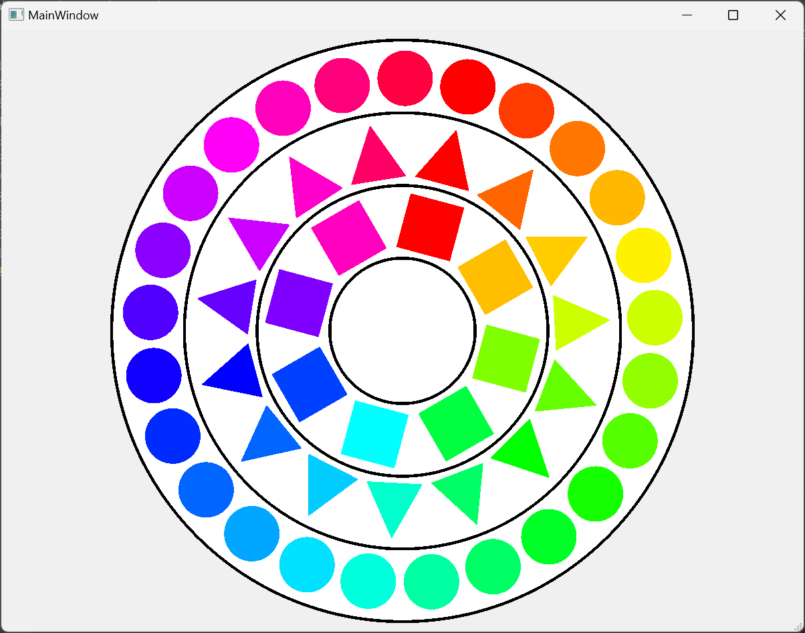
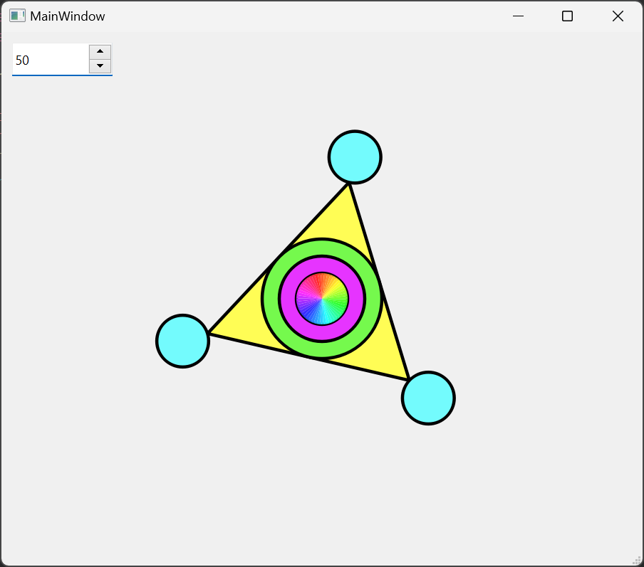
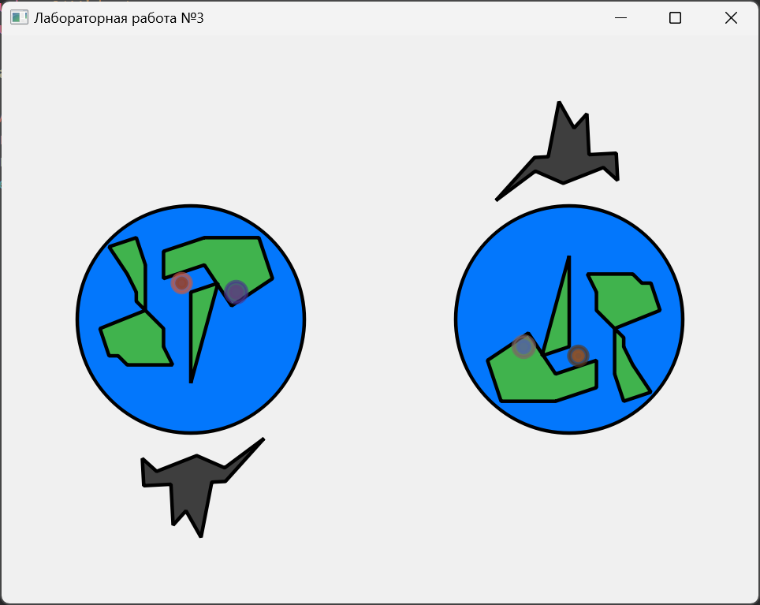
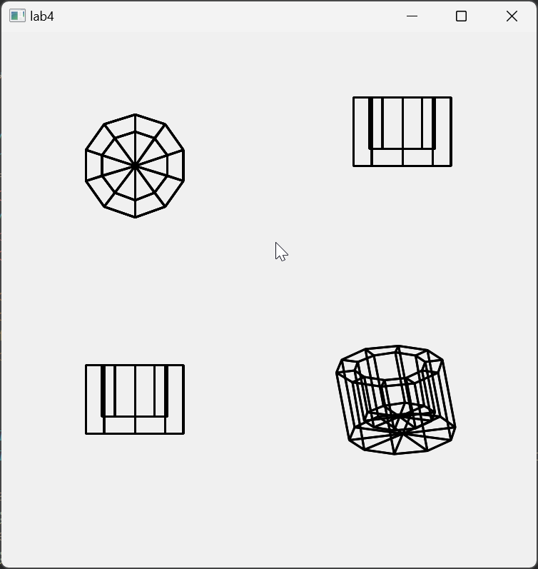
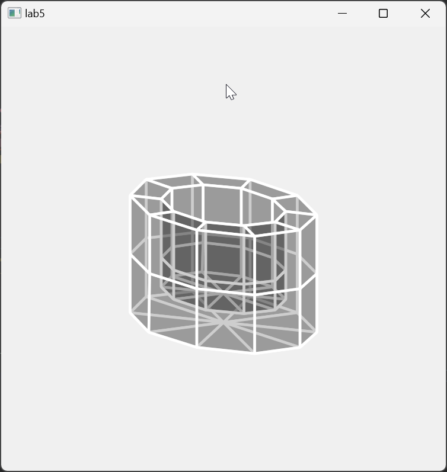

# Computer Graphics

This repository contains the lab works completed as part of the **Computer Graphics** course.

## Lab Work 1: GDI Graphic Primitives
Development of 2D graphic primitives using GDI in the Qt Creator environment.

### Results:

---

## Lab Work 2: GDI Graphic Primitives
Development of 2D graphic primitives using GDI in the Qt Creator environment.

### Results:

---

## Lab Work 3: Affine Transformations on a Plane
Development of skills in performing affine transformations on a plane and creating a graphical application using GDI in the Qt Creator environment.

### Results:

---

## Lab Work 4: Affine Transformations in Space
Development of skills in using affine transformations in space and creating a graphical application using GDI in the Qt Creator environment for visualizing basic 3D objects.

### Results:

---

## Lab Work 5: Hidden Surface Removal Algorithms
Implementation of algorithms for removing hidden surfaces and creating a program for visualizing a volumetric 3D model with filled faces. The program constructs a 3D model on the screen with filled faces based on the variant number of lab work 4.

### Results:

